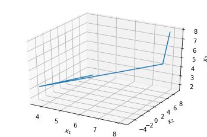
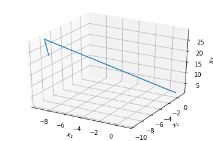

***************
Lorenz Examples
***************

The Lorenz module has several functions who serve to
create numpy arrays of data from arrays of time and
perturbations.

:py:func:`lorenz.lorenz96`
--------------------------

Example:

>>> N = 5
>>> F = 8
>>> t = np.arange(0,30.0, 1)
>>> x = np.arange(0,4,1)
>>> lorenz96(x, t, N, F)
    array([ 0.,  7.,  9., 11., -2.])

:py:func:`lorenz.generate_L96`
------------------------------

Example:

>>> F = 8
>>> P = 0.1
>>> N = 5
>>> t = np.arange(0, 4, 1)
>>> generate_L96(t, P, N, F)
    array([[ 8.01   ,  8.    ,  8.   ,  8.   ,  8. ],
       [11.26924566, 12.84391153, -0.72459535, -0.98975901,  3.37443344],
       [ 0.32729446, 11.42177354,  1.87815127,  2.61059131, -0.07544472],
       [-2.63491575,  3.05427465,  2.5680456 ,  3.20375244,  6.83414517]])

Plot:

>>> fig = plt.figure()
>>> ax = fig.gca(projection="3d")
>>> ax.plot(x[:, 0], x[:, 1], x[:, 2])
>>> ax.set_xlabel("$x_1$")
>>> ax.set_ylabel("$x_2$")
>>> ax.set_zlabel("$x_3$")
>>> plt.show()

:py:func:`lorenz.lorenz63`
--------------------------

Example:

>>> rho = 28
>>> sigma = 10
>>> beta = 8/3
>>> t = np.arange(0,30.0, 0.01)
>>> x = np.arange(0,5,1)
>>> lorenz63(x, t, rho, sigma, beta)
    array([10., -1., -5.33333333])

:py:func:`lorenz.generate_L63`
------------------------------

Example:

>>> rho = 28
>>> sigma = 10
>>> beta = 8/3
>>> t = np.arange(0,3.0, 1)
>>> generate_L63(t, rho, sigma, beta)
    array([[ 1., 1., 1.],
       [-9.37856995, -8.35703373, 29.36232527],
       [-8.17349956, -9.56202269, 24.62070256]])

Plot:

>>> fig = plt.figure()
>>> ax = fig.gca(projection="3d")
>>> ax.plot(x[:, 0], x[:, 1], x[:, 2])
>>> ax.set_xlabel("$x_1$")
>>> ax.set_ylabel("$x_2$")
>>> ax.set_zlabel("$x_3$")
>>> plt.show()

