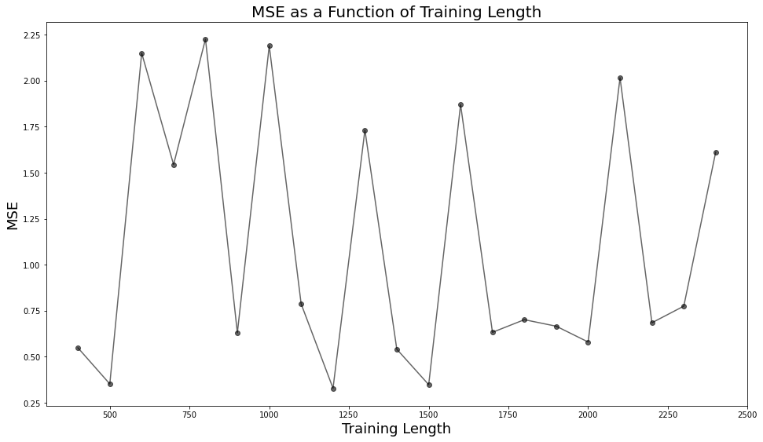

*******************
Optimizers Examples
*******************

The Optimizers module contains functions
which take in various parameters and
through methods like minimizing mean
squared error return optimum values.

:py:func:`optimizers.grid_optimizer`
-------------------------------------

Example:
This example minimizes the training length
for an example generated with the lorenz 96
model. To see how the other parameters were
determined, open the lorenx96-example Jupyter
Notebook. For this example, the parameters other
than training length will be taken as known, and
we will utilize grid_optimizer to determine
a good value for that parameter.

>>> t = np.arange(0,30.0, 0.01)
>>> x = generate_L96(t)
>>> params = {'n_reservoir':4000,
                'sparsity':0.03,
                'rand_seed':85,
                'rho':0.9,
                'noise':0.01,
                'future':72,
                'window':72,
                'trainlen':2000}
>>> trainingLengths = np.arange(400,2500,100)
>>> trainlen_loss = grid_optimizer(x,
                          params,
                          args=['trainlen'],
                          xset=trainingLengths,
                          verbose=True,
                          visualize=True)

>>> minloss = np.min(trainlen_loss)
>>> index_min = np.where(trainlen_loss == minloss)
>>> l_opt = trainingLengths[index_min][0]
>>> params['trainlen'] = l_opt
>>>
>>> print(f"Training length with minimum error was: {l_opt}")
    Training length with minimum error was: 1200
