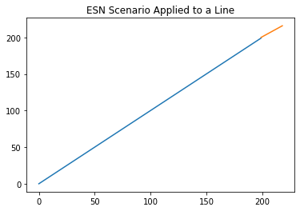

**************
Tools Examples
**************

The Tools module contains a variety of
functions that aide in the error
assessment, and ESN applications.

:py:func:`tools.MSE`
--------------------

Example:

>>> yhat = np.arange(0,2,1)
>>> y = np.arange(3,4,1)
>>> MSE(yhat,y)
    2.5495097567963922

:py:func:`tools.param_string`
-----------------------------

Example:

>>> params = {
   'n_reservoir': 600,
   'sparsity': 0.1,
   'rand_seed': 85,
   'rho': 0.7,
   'noise': 0.001,
   'future': 20,
   'window': 3,
   'trainlen': 500
}
>>> param_string(params)
    'Reservoir Size:600, Sparsity: 0.1, Spectral Radius: 0.7, Noise: 0.001,
    Training Length: 500, Prediction Window: 3'

:py:func:`optimal_values`
-------------------------

Example:

>>> xset = np.matrix([[1,2],[3,4]])
>>> yset = np.matrix([[1,2],[3,4]])
>>> loss = np.matrix([[1,2],[0,1]])
>>> optimal_values(loss, xset, yset)
    (matrix([[3, 4]]), matrix([[1, 2]]))

:py:func:`esn_prediction`
-------------------------

Example:

>>> data = np.arange(0,200,1)
>>> params = {'n_reservoir': 600,
              'sparsity': 0.1,
              'rand_seed': 85,
              'rho': 0.7,
              'noise': 0.0001,
              'future': 20,
              'window': 4,
              'trainlen': 120}
>>> esn_prediction(data,params)
    array([
       [179.96847224],
       [180.91618768],
       [181.86422127],
       [182.77469821],
       [183.92124944],
       [184.84607557],
       [185.74887841],
       [186.6408091 ],
       [187.92495103],
       [188.81949313],
       [189.71348691],
       [190.60141575],
       [191.9528515 ],
       [192.91274887],
       [193.83421269],
       [194.7837955 ],
       [195.9295301 ],
       [196.820348  ],
       [197.72993036],
       [198.63995168]
    ])

:py:func:`esn_scenario`
-----------------------

Example:

>>> data = np.arange(0,200,1)
>>> params = {'n_reservoir': 600,
              'sparsity': 0.1,
              'rand_seed': 85,
              'rho': 0.7,
              'noise': 0.000,
              'future': 20,
              'window': 4,
              'trainlen': 120}
>>> esn_scen = esn_scenario(data,params)
    (array([[199.90028468],
        [200.75821551],
        [201.60046524],
        [202.43699788],
        [203.27151745],
        [204.10539996],
        [204.93915767],
        [205.77298275],
        [206.6069489 ],
        [207.44108604],
        [208.27540786],
        [209.10992208],
        [209.94463419],
        [210.77954885],
        [211.61467034],
        [212.45000285],
        [213.28555042],
        [214.12131705],
        [214.95730668],
        [215.79352317]]),
   <pyESN.pyESN.ESN at 0x7fa46138a250>)

Plots:

>>> x = []
>>> for i in esn_scen:
>>>     if type(i) is numpy.ndarray:
>>>         for subset in i:
>>>             for subsubset in subset:
>>>                 x.append(subsubset)
>>>     else:
>>>         pass
>>> t = np.arange(199,219,1)
>>> line = plt.plot(data,data)
>>> scenario = plt.plot(t,x)
>>> plt.title('ESN Scenario Applied to a Line')
>>> plt.show(line, scenario)

